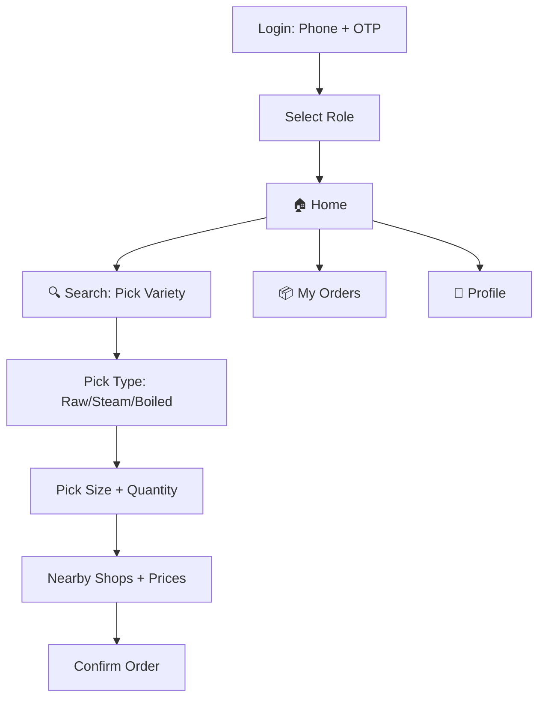
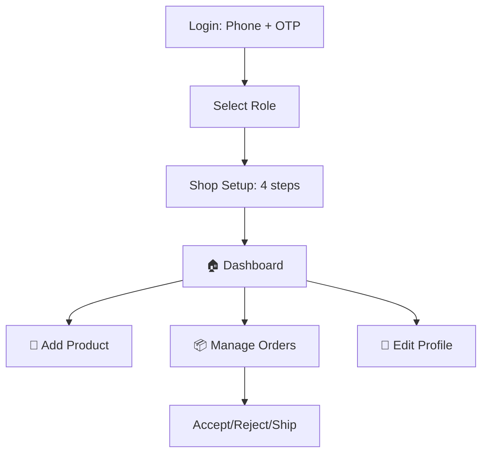

# 📱 Rice App — Complete Workflow Design

> **Design Rule #1**: If your grandmother in a village can't figure it out in 5 seconds, it's too complicated.


---

## 🎯 Core Design Principles

| Principle | How |
|-----------|-----|
| **Big, fat buttons** | Minimum 56dp touch targets, ideally 64dp |
| **Icons speak louder than words** | Every action has a recognizable icon + short text |
| **Minimal choices per screen** | Max 3-4 options per screen, never overwhelm |
| **Visual-first** | Show rice photos, not text descriptions |
| **One action per screen** | Each screen does ONE thing |
| **Phone number = Identity** | No email, no password, just phone + OTP |
| **Regional language first** | Telugu/Hindi toggle always visible at top |
| **WhatsApp-familiar patterns** | Use UI patterns villagers already know from WhatsApp |

---

## 🔐 Login Flow (Phone Number OTP)

```
┌─────────────────────────────────────┐
│                                     │
│      🌾 Rice Market                 │
│      "సరైన బియ్యం, సరైన ధర"         │
│      (Right Rice, Right Price)      │
│                                     │
│   ┌─────────────────────────────┐   │
│   │  🇮🇳 +91  │  Phone Number   │   │
│   └─────────────────────────────┘   │
│                                     │
│   ┌─────────────────────────────┐   │
│   │      📲 Send OTP            │   │
│   └─────────────────────────────┘   │
│                                     │
│   [🇮🇳 తెలుగు] [🇮🇳 हिंदी] [🇬🇧 EN]  │
│                                     │
└─────────────────────────────────────┘
           ↓ OTP Sent
┌─────────────────────────────────────┐
│                                     │
│      Enter OTP sent to              │
│      📱 98765 XXXXX                 │
│                                     │
│      ┌──┐ ┌──┐ ┌──┐ ┌──┐ ┌──┐ ┌──┐ │
│      │  │ │  │ │  │ │  │ │  │ │  │ │
│      └──┘ └──┘ └──┘ └──┘ └──┘ └──┘ │
│                                     │
│      Auto-verifies when typed       │
│                                     │
│      Didn't get OTP?                │
│      [Resend in 30s]                │
│                                     │
└─────────────────────────────────────┘
           ↓ First Time User?
┌─────────────────────────────────────┐
│                                     │
│      Who are you?                   │
│      (మీరు ఎవరు?)                   │
│                                     │
│   ┌──────────┐  ┌──────────┐        │
│   │   🏪     │  │   🛒     │        │
│   │          │  │          │        │
│   │ TRADER   │  │ CUSTOMER │        │
│   │ (అమ్మేవారు)│  │(కొనేవారు) │        │
│   └──────────┘  └──────────┘        │
│                                     │
│   Big cards with icons              │
│   Tap once → Done                   │
│                                     │
└─────────────────────────────────────┘
```

> [!TIP]
> **Why phone OTP?** 
> - Villagers remember phone numbers, not emails/passwords
> - OTP auto-reads on Android (SMS Retriever API)
> - One-tap verification — zero typing needed
> - Same pattern as every Indian app they already use (Paytm, PhonePe, WhatsApp)

---

## 🛒 BUYER (Customer) Journey

### Bottom Navigation Bar (4 tabs only)

```
┌────────┬────────┬────────┬────────┐
│  🏠    │  🔍    │  📦    │  👤    │
│ Home   │ Search │ Orders │ Profile│
│ హోమ్   │ వెతుకు  │ ఆర్డర్లు│ ప్రొఫైల్│
└────────┴────────┴────────┴────────┘
```

### Screen 1: HOME (🏠)

```
┌─────────────────────────────────────┐
│ 📍 Kadapa, AP          [తెలుగు ▼]  │
│─────────────────────────────────────│
│                                     │
│  🔍 "బియ్యం వెతకండి..."              │
│     (Search for rice...)            │
│                                     │
│ ── What do you need? ──────────────│
│                                     │
│  ┌────────┐ ┌────────┐ ┌────────┐  │
│  │  🍚   │ │  🎉   │ │  💪   │  │
│  │ Daily  │ │Event / │ │Healthy │  │
│  │ Rice   │ │Function│ │ Rice   │  │
│  │రోజువారీ │ │ఫంక్షన్  │ │ఆరోగ్యం  │  │
│  └────────┘ └────────┘ └────────┘  │
│                                     │
│ ── Today's Best Deals 🔥 ─────────│
│                                     │
│  ┌──────────────────────────────┐  │
│  │ 📸 [Rice Photo]              │  │
│  │ Sona Masuri - 26kg           │  │
│  │ ₹1,180  (was ₹1,280)        │  │
│  │ 📍 2.3 km away              │  │
│  └──────────────────────────────┘  │
│                                     │
│  ┌──────────────────────────────┐  │
│  │ 📸 [Rice Photo]              │  │
│  │ BPT 5204 - 26kg             │  │
│  │ ₹1,050                      │  │
│  │ 📍 4.1 km away              │  │
│  └──────────────────────────────┘  │
│                                     │
│ ── Today's Market Price 📊 ───────│
│                                     │
│  Sona Masuri  ₹48/kg  ↑ ₹2        │
│  BPT 5204    ₹42/kg  ↓ ₹1        │
│  Basmati     ₹85/kg  ── same      │
│                                     │
└─────────────────────────────────────┘
```

### Screen 2: SEARCH (🔍)

```
┌─────────────────────────────────────┐
│ ← Search Rice                       │
│─────────────────────────────────────│
│                                     │
│  Step 1: What rice?                 │
│  (ఏ బియ్యం కావాలి?)                  │
│                                     │
│  ┌────────┐ ┌────────┐ ┌────────┐  │
│  │ Sona   │ │  BPT   │ │Basmati │  │
│  │Masuri  │ │  5204  │ │        │  │
│  └────────┘ └────────┘ └────────┘  │
│  ┌────────┐ ┌────────┐ ┌────────┐  │
│  │  HMT   │ │  RNR   │ │ Kolam  │  │
│  └────────┘ └────────┘ └────────┘  │
│  ┌────────┐ ┌────────┐             │
│  │Organic │ │Diabetic│             │
│  │ Rice   │ │ Rice   │             │
│  └────────┘ └────────┘             │
│                                     │
└─────────────────────────────────────┘
           ↓ Taps "Sona Masuri"
┌─────────────────────────────────────┐
│ ← Sona Masuri                       │
│─────────────────────────────────────│
│                                     │
│  Step 2: Which type?                │
│  (ఏ రకం?)                           │
│                                     │
│  ┌───────────────┐ ┌─────────────┐ │
│  │  🌾 Raw Rice  │ │ ♨️ Steam    │ │
│  │   పచ్చి బియ్యం │ │  ఉడికిన     │ │
│  └───────────────┘ └─────────────┘ │
│  ┌───────────────┐ ┌─────────────┐ │
│  │  🫕 Boiled    │ │ 🟤 Brown   │ │
│  │   ఉడకబెట్టిన  │ │  బ్రౌన్      │ │
│  └───────────────┘ └─────────────┘ │
│                                     │
└─────────────────────────────────────┘
           ↓ Taps "Steam Rice"
┌─────────────────────────────────────┐
│ ← Sona Masuri - Steam              │
│─────────────────────────────────────│
│                                     │
│  Step 3: How much?                  │
│  (ఎంత కావాలి?)                      │
│                                     │
│  ┌──────┐ ┌──────┐ ┌──────┐        │
│  │ 1 kg │ │ 5 kg │ │10 kg │        │
│  └──────┘ └──────┘ └──────┘        │
│  ┌──────┐ ┌──────┐                 │
│  │26 kg │ │50 kg │  ← HIGHLIGHTED  │
│  │ ✓    │ │      │    (most used)  │
│  └──────┘ └──────┘                 │
│                                     │
│  Bags:  [ - ]  1  [ + ]            │
│                                     │
│  ┌─────────────────────────────┐   │
│  │  🔍 Show Nearby Shops       │   │
│  │     సమీపంలోని షాపులు చూడండి   │   │
│  └─────────────────────────────┘   │
│                                     │
└─────────────────────────────────────┘
           ↓ Taps "Show Nearby Shops"
┌─────────────────────────────────────┐
│ ← Nearby Shops                      │
│─────────────────────────────────────│
│                                     │
│  Distance: [5 km ▼]                │
│  ── 3 shops found ─────────────────│
│                                     │
│  ┌──────────────────────────────┐  │
│  │ 🏪 Sri Lakshmi Rice Store   │  │
│  │ ⭐ 4.5 (120 reviews)        │  │
│  │ 📍 1.2 km · Wholesaler      │  │
│  │                              │  │
│  │ Sona Masuri Steam - 26kg    │  │
│  │ ₹1,180  ✅ LOWEST PRICE     │  │
│  │                              │  │
│  │ [📸 Bag Photo] [📸 Cooked]  │  │
│  │                              │  │
│  │  ┌─────────────────────┐    │  │
│  │  │  🛒 Order Now       │    │  │
│  │  └─────────────────────┘    │  │
│  └──────────────────────────────┘  │
│                                     │
│  ┌──────────────────────────────┐  │
│  │ 🏪 Balaji Rice Traders      │  │
│  │ ⭐ 4.2 (85 reviews)         │  │
│  │ 📍 3.5 km · Retailer        │  │
│  │                              │  │
│  │ Sona Masuri Steam - 26kg    │  │
│  │ ₹1,250                      │  │
│  │  ┌─────────────────────┐    │  │
│  │  │  🛒 Order Now       │    │  │
│  │  └─────────────────────┘    │  │
│  └──────────────────────────────┘  │
│                                     │
└─────────────────────────────────────┘
```

### Screen: ORDER CONFIRMATION

```
┌─────────────────────────────────────┐
│ ← Confirm Order                     │
│─────────────────────────────────────│
│                                     │
│  📸 [Rice Photo]                    │
│  Sona Masuri (Steam) - 26kg        │
│  From: Sri Lakshmi Rice Store      │
│                                     │
│  ── Order Summary ─────────────────│
│  │ 1 × 26kg Bag        ₹1,180 │   │
│  │ Delivery (1.2 km)   FREE   │   │
│  │─────────────────────────────│   │
│  │ Total               ₹1,180 │   │
│  └─────────────────────────────┘   │
│                                     │
│  📍 Delivery Address               │
│  ┌─────────────────────────────┐   │
│  │ [Your address here...     ] │   │
│  └─────────────────────────────┘   │
│                                     │
│  ┌─────────────────────────────┐   │
│  │  ✅ Place Order              │   │
│  │     ఆర్డర్ చేయండి             │   │
│  └─────────────────────────────┘   │
│                                     │
│  ┌─────────────────────────────┐   │
│  │  💬 Chat on WhatsApp        │   │
│  │     WhatsApp లో మాట్లాడండి    │   │
│  └─────────────────────────────┘   │
│                                     │
└─────────────────────────────────────┘
```

---

## 🏪 TRADER Journey

### Bottom Navigation Bar (4 tabs)

```
┌────────┬────────┬────────┬────────┐
│  🏠    │  🌾    │  📦    │  👤    │
│ Home   │Products│ Orders │ Profile│
│ హోమ్   │ఉత్పత్తులు│ ఆర్డర్లు│ ప్రొఫైల్│
└────────┴────────┴────────┴────────┘
```

### Trader: First-Time Setup

```
Welcome! Let's set up your shop.
(మీ షాపు సెటప్ చేద్దాం!)

Step 1/4: Shop Photo
┌─────────────────────────────────────┐
│                                     │
│       ┌──────────────────┐          │
│       │                  │          │
│       │   📷 Take Photo  │          │
│       │   of your shop   │          │
│       │                  │          │
│       └──────────────────┘          │
│                                     │
│       [📸 Camera] [🖼️ Gallery]      │
│                                     │
└─────────────────────────────────────┘

Step 2/4: Shop Details
┌─────────────────────────────────────┐
│                                     │
│  Shop Name (షాపు పేరు)              │
│  ┌─────────────────────────────┐   │
│  │ Sri Lakshmi Rice Store      │   │
│  └─────────────────────────────┘   │
│                                     │
│  Owner Name (యజమాని పేరు)          │
│  ┌─────────────────────────────┐   │
│  │ Ramesh Kumar                │   │
│  └─────────────────────────────┘   │
│                                     │
│  I am a: (నేను ఒక:)               │
│  ┌──────────┐  ┌──────────┐        │
│  │  📦      │  │  🏪      │        │
│  │Wholesaler│  │ Retailer │        │
│  │హోల్‌సేలర్ │  │ రిటైలర్   │        │
│  └──────────┘  └──────────┘        │
│                                     │
│  [Next →]                           │
└─────────────────────────────────────┘

Step 3/4: Location
┌─────────────────────────────────────┐
│                                     │
│       ┌──────────────────┐          │
│       │   📍 Use My      │          │
│       │   Current        │          │
│       │   Location       │          │
│       │                  │          │
│       │ (GPS icon anim)  │          │
│       └──────────────────┘          │
│                                     │
│  One tap — auto-detects location    │
│                                     │
└─────────────────────────────────────┘

Step 4/4: Done! ✅
```

### Trader: Add Product (Super Simple)

```
┌─────────────────────────────────────┐
│ ← Add Rice Product                  │
│─────────────────────────────────────│
│                                     │
│  Rice Variety (బియ్యం రకం)           │
│  ┌────────┐ ┌────────┐ ┌────────┐  │
│  │ Sona   │ │  BPT   │ │Basmati │  │
│  │Masuri ✓│ │  5204  │ │        │  │
│  └────────┘ └────────┘ └────────┘  │
│  ┌────────┐ ┌────────┐ ┌────────┐  │
│  │  HMT   │ │  RNR   │ │ Other  │  │
│  └────────┘ └────────┘ └────────┘  │
│                                     │
│  Rice Type (రకం)                    │
│  ┌────────┐ ┌────────┐             │
│  │🌾 Raw  │ │♨️Steam✓│             │
│  └────────┘ └────────┘             │
│  ┌────────┐ ┌────────┐             │
│  │🫕Boiled│ │🟤Brown │             │
│  └────────┘ └────────┘             │
│                                     │
│  ── Set Prices (ధరలు) ────────────│
│                                     │
│  Pack Size    Price (₹)            │
│  ┌────────────────────────────┐    │
│  │ ☐ 1 kg    │ [₹ ____]     │    │
│  │ ☐ 5 kg    │ [₹ ____]     │    │
│  │ ☐ 10 kg   │ [₹ ____]     │    │
│  │ ☑ 26 kg   │ [₹ 1280]     │    │
│  │ ☑ 50 kg   │ [₹ 2400]     │    │
│  └────────────────────────────┘    │
│  (Check only sizes you sell)       │
│                                     │
│  ── Photos ───────────────────────│
│  ┌────────┐ ┌────────┐ ┌────────┐ │
│  │  📸    │ │  📸    │ │  📸    │ │
│  │  Bag   │ │ Grain  │ │ Cooked │ │
│  │ Photo  │ │ Photo  │ │ Photo  │ │
│  └────────┘ └────────┘ └────────┘ │
│                                     │
│  ┌─────────────────────────────┐   │
│  │  ✅ Add Product              │   │
│  └─────────────────────────────┘   │
│                                     │
└─────────────────────────────────────┘
```

### Trader: My Orders

```
┌─────────────────────────────────────┐
│ My Orders (నా ఆర్డర్లు)              │
│─────────────────────────────────────│
│                                     │
│ [New 🔴3] [Confirmed] [Shipped]    │
│                                     │
│  ┌──────────────────────────────┐  │
│  │ 🛒 Order #4521               │  │
│  │ Ravi Kumar · 📱 98765XXXXX  │  │
│  │ Sona Masuri 26kg × 2 bags   │  │
│  │ ₹2,560                      │  │
│  │ 📍 3.2 km away              │  │
│  │                              │  │
│  │ ┌──────────┐ ┌──────────┐   │  │
│  │ │ ✅Accept │ │ ❌Reject │   │  │
│  │ └──────────┘ └──────────┘   │  │
│  │                              │  │
│  │ [📞 Call Customer]           │  │
│  └──────────────────────────────┘  │
│                                     │
└─────────────────────────────────────┘
```

---

## 📱 Complete Screen Map

### Buyer App (6 screens total)



### Trader App (7 screens total)



---

## 🗣️ Language Strategy

```
┌─────────────────────────────────────┐
│  Every screen has DUAL text:        │
│                                     │
│  Big text: తెలుగు / हिंदी            │
│  Small text below: English          │
│                                     │
│  Example:                           │
│  ┌─────────────────────────────┐   │
│  │   🛒 ఆర్డర్ చేయండి           │   │
│  │      Place Order             │   │
│  └─────────────────────────────┘   │
│                                     │
│  Language toggle always visible     │
│  at top-right of every screen       │
└─────────────────────────────────────┘
```

---

## 📊 Buyer Home Screen Priority

Order of importance (what villagers care about most):

```
1. 🔍 SEARCH BAR          — "I want to find rice"
2. 🏷️ TODAY'S BEST DEALS  — "Where is it cheapest?"  
3. 📊 MARKET PRICE        — "What's today's rate?"
4. 🌾 CATEGORIES          — "Daily / Function / Healthy"
```

---

## 🔔 Notification Strategy

| Event | Buyer Gets | Trader Gets |
|-------|-----------|-------------|
| New order | Order confirmed ✅ | 🔔 New order! Accept now |
| Order shipped | Your rice is on the way 🚚 | — |
| Price drop nearby | 🔥 BPT 5204 dropped to ₹1,050 | — |
| New customer order | — | 🛒 Ravi wants 2 bags of Sona Masuri |

---

## 🎨 Color & Visual Style

```
Primary:    #2E7D32 (Rice Field Green)
Accent:     #FF6F00 (Warm Orange — CTA buttons)
Background: #FAFAFA (Light gray — easy on eyes)
Text:       #212121 (Dark — high contrast)
Cards:      #FFFFFF with subtle shadow

Font sizes:
- Headers:  24-28sp (large, readable)
- Body:     18sp (bigger than normal apps)
- Labels:   14sp  
- Minimum:  14sp (never smaller)
```

> [!IMPORTANT]
> **No tiny text. No complex navigation. No hidden menus.**
> A 50-year-old farmer with reading glasses should be able to use every feature.

---

## 🚀 Tech Stack Decision

| Layer | Technology | Why |
|-------|-----------|-----|
| **Mobile App** | React Native | Native feel + reuse JS skills |
| **Backend API** | Existing Node.js/Express | Already built, just extend |
| **Database** | Existing MongoDB | Already has all models |
| **Auth** | Phone OTP via Firebase Auth | Free, reliable, auto-reads SMS |
| **Images** | Existing Cloudinary | Already optimized |
| **Location** | React Native Geolocation | Native GPS access |
| **Notifications** | Firebase Cloud Messaging | Free push notifications |
| **Language** | i18next (same library) | Already have translations |

---

## 📋 Implementation Order

```
Week 1:  Backend schema changes (multi-pack pricing, trader type, rice type)
         Phone OTP auth endpoint (Firebase Auth integration)

Week 2:  React Native project setup
         Login + OTP screen
         Role selection screen

Week 3:  Buyer: Home screen + Search flow
         Buyer: Nearby shops + price comparison

Week 4:  Buyer: Order flow + order tracking
         Trader: Shop setup + profile

Week 5:  Trader: Add/edit products
         Trader: Order management

Week 6:  Testing + Play Store submission
         Telugu/Hindi translations
```
